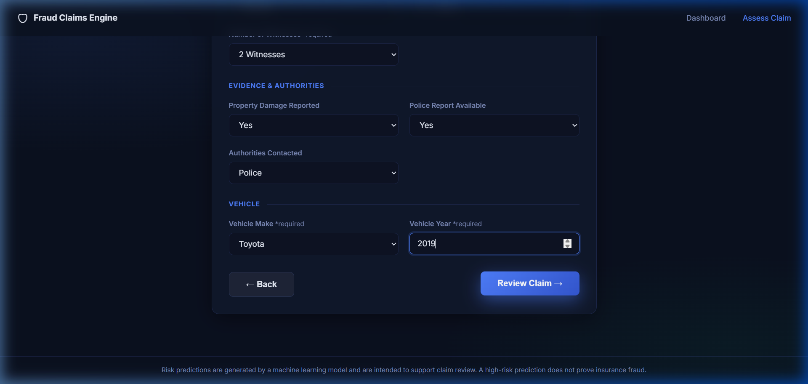
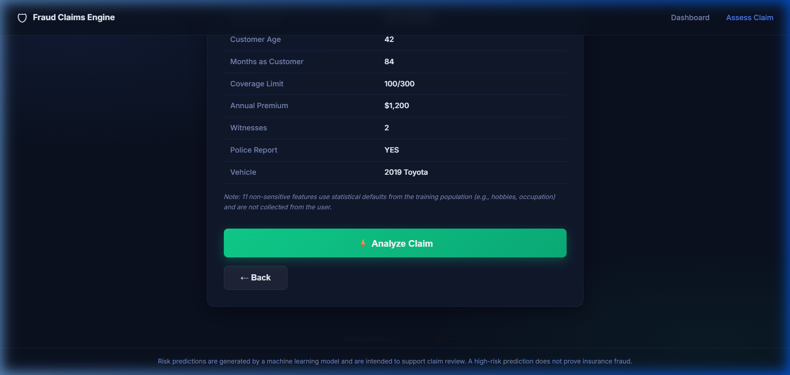
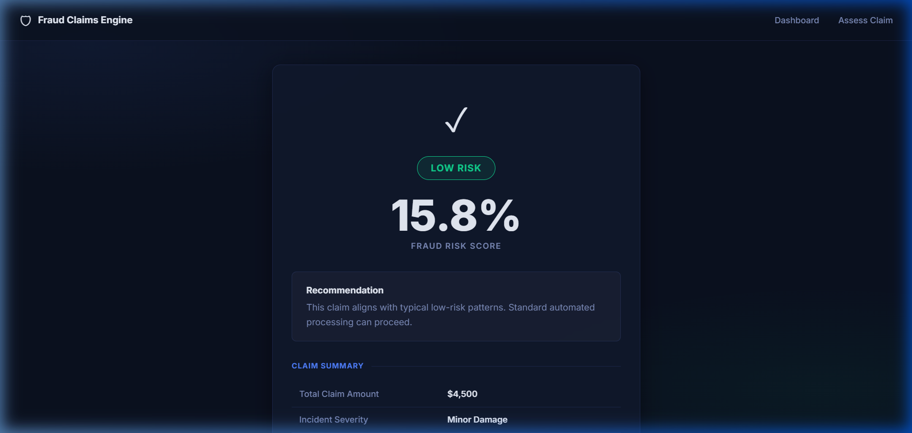
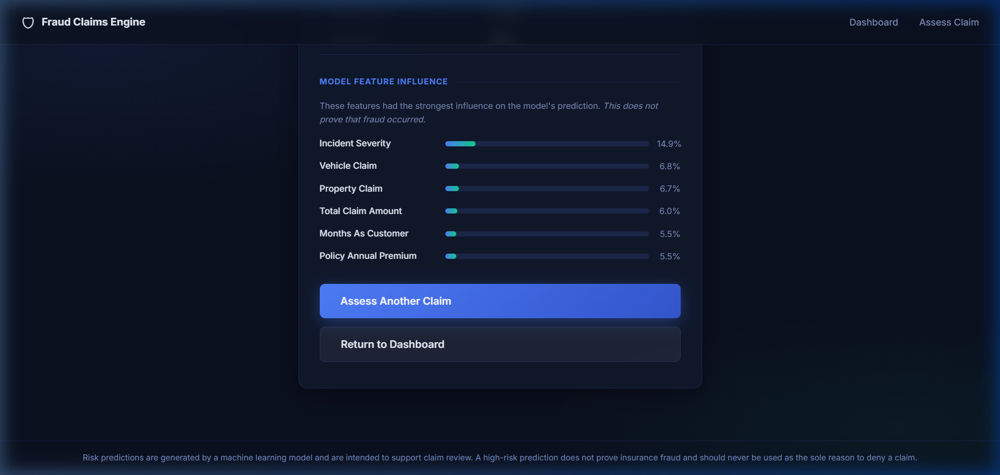

# Insurance Fraud Claims Detection Engine

[](https://python.org)
[](https://flask.palletsprojects.com)
[](https://scikit-learn.org)
[](LICENSE)

> An end-to-end Machine Learning project that assesses the **fraud risk** of auto insurance claims using a trained Random Forest classifier, served via a modern Flask web application.

---

## 1. Project Overview

The Insurance Fraud Claims Detection Engine is a complete UG-level ML project that:

- Loads and analyses **1,000 historical auto insurance claims**.
- Trains and compares **3 classification models** (Logistic Regression, Decision Tree, Random Forest).
- Selects the best model based on **Recall and F1-score** — metrics appropriate for fraud detection.
- Exposes a professional **4-step web form** where a claim can be assessed and a risk score returned in real time.

---

## 2. Problem Statement

Insurance fraud costs the global industry **billions of dollars annually**, raising premiums for honest customers. Manual review of every claim is slow and error-prone. This project demonstrates how a machine learning system can automatically flag suspicious claims for priority investigation.

---

## 3. Objectives

- Automate the initial screening of auto insurance claims.
- Maximise **Recall** — catching as many real fraud cases as possible.
- Provide a clean, user-friendly web interface for non-technical investigators.
- Save and serve the trained model as a Flask web application.

---

## 4. Technology Stack

| Layer | Technologies |
|---|---|
| Language | Python 3.11 |
| Data Processing | pandas, NumPy |
| Machine Learning | scikit-learn, joblib |
| Visualisation | matplotlib, seaborn |
| Web Framework | Flask 3.x |
| Frontend | HTML5, Vanilla CSS (Dark Mode) |
| Model Persistence | joblib (.pkl) |

---

## 5. Dataset

| Attribute | Value |
|---|---|
| Source | Auto Insurance Claims (Synthetic/Historical) |
| Total Records | 1,000 |
| Raw Features | 40 |
| Features Used by Model | 22 |
| Target Variable | `fraud_reported` (Y = Fraud, N = Not Fraud) |
| Class Distribution | 75.3% Non-Fraud / 24.7% Fraud |

---

## 6. Machine Learning Workflow

```
Raw Dataset (1,000 records, 40 columns)
        |
Data Cleaning
  - Replace ? with NaN
  - Drop empty column (_c39)
  - Drop identifier columns (policy_number, insured_zip, etc.)
  - Drop date and low-signal columns
        |
Exploratory Data Analysis
  - Fraud distribution (24.7% imbalanced)
  - Total claim amount vs fraud
  - Incident severity vs fraud
  - Correlation matrix
        |
Feature Selection (22 columns: 14 numerical + 8 categorical)
        |
Train / Test Split (80% training / 20% testing, stratified)
        |
Preprocessing Pipeline
  - Numerical: Median Imputation + StandardScaler
  - Categorical: Mode Imputation + OneHotEncoder
        |
Model Training (3 classifiers, class_weight=balanced)
        |
Model Comparison (Accuracy, Precision, Recall, F1, ROC-AUC)
        |
Final Model: Random Forest (best overall Recall + F1)
        |
Evaluation: Confusion Matrix, ROC Curve, Feature Importance
        |
Model Saved to model/model.pkl + model/preprocessing.pkl
```

---

## 7. System Architecture

```
User enters claim details (4-step web form)
        |
Flask Backend receives form POST
        |
Input Validation (required fields + numeric type checks)
        |
Preprocessing Pipeline (loaded from preprocessing.pkl)
  Imputation -> Scaling -> OneHotEncoding
        |
Random Forest Classifier (loaded from model.pkl)
        |
Fraud Probability Score (0 to 100%)
        |
Risk Level:  < 35%  = LOW RISK
            35-60%  = MEDIUM RISK
             > 60%  = HIGH RISK
        |
Result displayed in web UI with feature influence bars
```

---

## 8. Project Structure

```
insurance-fraud-detection/
|
+-- app/
|   +-- app.py                    Flask application (routes, prediction logic)
|   +-- static/
|   |   +-- style.css             Dark mode UI design
|   +-- templates/
|       +-- index.html            Dashboard / landing page
|       +-- assess.html           4-step claim input form
|       +-- result.html           Fraud risk result page
|
+-- data/
|   +-- raw/
|       +-- insurance_claims.csv  Original dataset (1,000 records, 40 columns)
|
+-- model/
|   +-- model.pkl                 Trained Random Forest classifier
|   +-- preprocessing.pkl         Fitted ColumnTransformer pipeline
|   +-- model_columns.pkl         Ordered feature column list (22 features)
|   +-- feature_names.pkl         Encoded feature names (50 after OHE)
|   +-- hidden_defaults.pkl       Background statistical defaults
|
+-- notebooks/
|   +-- insurance_fraud_analysis.ipynb   Complete ML notebook (39 cells, 8 figures)
|
+-- src/
|   +-- preprocessing.py          Reusable preprocessing utilities
|   +-- save_final_model.py       Standalone model training and save script
|
+-- tests/
|   +-- test_app.py               Flask application tests
|
+-- .gitignore
+-- LICENSE
+-- README.md
+-- requirements.txt
```

---

## 9. Model Comparison

Three models were trained on the same preprocessing pipeline and evaluated on a held-out 20% test set (200 records, stratified by fraud label).

| Model | Accuracy | Precision | Recall | F1-Score | ROC-AUC |
|---|---:|---:|---:|---:|---:|
| Logistic Regression | 80.5% | 57.8% | 75.5% | 65.5% | 80.3% |
| Decision Tree | 72.0% | 44.9% | 63.3% | 52.5% | 65.0% |
| **Random Forest** | **80.5%** | **58.6%** | **69.4%** | **63.6%** | **77.6%** |

> **Why Recall matters for fraud detection:**
> With 75% non-fraud claims, a naive model can achieve 75% accuracy by always predicting
> "Not Fraud" — but catches zero real fraud cases. Recall (69.4%) tells us what fraction
> of actual fraud cases the model correctly identifies. Missing real fraud (False Negative)
> is far more costly than a false alarm (False Positive).

---

## 10. Final Model — Random Forest

| Parameter | Value |
|---|---|
| Algorithm | Random Forest Classifier |
| Number of Trees | 100 |
| Max Depth | 10 |
| Class Weight | balanced |
| **Accuracy** | **80.5%** |
| **Precision** | **58.6%** |
| **Recall** | **69.4%** |
| **F1-Score** | **63.6%** |
| **ROC-AUC** | **77.6%** |

**Top predictive features (by importance):**
1. Incident Severity
2. Vehicle Claim Amount
3. Property Claim Amount
4. Total Claim Amount
5. Months as Customer
6. Annual Premium

---

## 11. Notebook

The complete ML analysis is in:

```
notebooks/insurance_fraud_analysis.ipynb
```

**39 cells | 8 embedded figures | all outputs pre-executed**

Sections:
1. Introduction
2. Load Dataset
3. Dataset Overview
4. Data Cleaning
5. Exploratory Data Analysis (4 graphs)
6. Feature Selection
7. Train-Test Split
8. Data Preprocessing
9. Model Training (3 models)
10. Model Comparison (table + bar chart)
11. Final Model Evaluation (Confusion Matrix, ROC Curve, Feature Importance)
12. Sample Predictions
13. Conclusion + Appendix: Save Model Artifacts

---

## 12. Installation

```bash
# 1. Clone the repository
git clone <YOUR_GITHUB_URL>
cd insurance-fraud-detection

# 2. Create and activate virtual environment
python -m venv .venv
.venv\Scripts\activate        # Windows
# source .venv/bin/activate   # macOS / Linux

# 3. Install dependencies
pip install -r requirements.txt
```

---

## 13. Running Locally

```bash
python app/app.py
```

Navigate to: **http://127.0.0.1:5000**

The application loads the pre-trained model from `model/model.pkl` at startup.
No retraining is required to run the web application.

---

## 14. Example Predictions (Chrome-verified)

| Claim Type | Key Signals | Result | Fraud Probability |
|---|---|---|---:|
| Normal Claim | Minor Damage, 2 witnesses, police report YES, $4,500 total | LOW RISK | 15.8% |
| Suspicious Claim | Total Loss, 0 witnesses, no police report, $92,000 total | HIGH RISK | 88.0% |

---

## 15. Application Screenshots

### Dashboard / Landing Page


### 4-Step Claim Assessment Form (Step 3: Incident Details)


### Form Review Stage (Step 4)


### Prediction Result Page (Low Risk Claim)


### Prediction Result Page (Risk Analysis & Feature Contributions)


---

## 16. How to Retrain the Model

Open `notebooks/insurance_fraud_analysis.ipynb` in Jupyter and run all cells.
The Appendix cell saves all model artifacts to `model/`.

Alternatively, use the standalone script:

```bash
python src/save_final_model.py
```

---

## 17. Limitations

- Trained on a synthetic/historical dataset; may not generalise to all real-world markets.
- Self-reported incident details (e.g., severity, witnesses) can be falsified by fraudsters.
- Feature importance shows statistical correlation, not causation.
- The current prototype does not support real-time data feeds or external API integration.

---

## 18. Future Enhancements

- SHAP values for per-prediction explanation (explainable AI).
- Computer Vision to analyse submitted car damage photos.
- NLP to extract signals from free-text police and incident reports.
- Hyperparameter tuning with cross-validation.
- User authentication and audit logging for production deployment.

---

## 19. Disclaimer

> This is an academic/educational project prototype. All predictions represent statistical
> risk modelling and are intended as a decision-support tool for human investigators.
> A high-risk prediction does NOT prove insurance fraud and must never be used as the sole
> reason to deny a claim without proper human review.

---

## 20. License

MIT License — see [LICENSE](LICENSE) for details.

